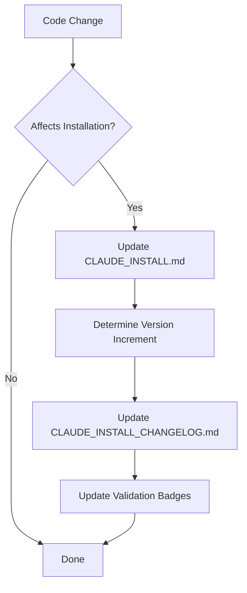

# CLAUDE_DEV.md - Development Entrypoint

**Version**: 1.0.0
**Last Updated**: 2025-10-25
**Purpose**: Main entrypoint for AI agents performing development work on this project

---

## Overview

This document serves as the primary entrypoint when an AI agent (Claude Code) is performing development work on this project. It defines policies, workflows, and responsibilities for maintaining living documentation throughout the development lifecycle.

**Key Principle**: As you develop and modify this project, you MUST keep installation and setup documentation synchronized with code changes.

---

## Living Documentation System

This project uses a **living documentation** system consisting of three interconnected documents:

1. **CLAUDE_DEV.md** (this file) - Development policies and workflows
2. **CLAUDE_INSTALL.md** - Interactive installation and setup guide
3. **CLAUDE_INSTALL_CHANGELOG.md** - Version-controlled changelog of installation changes

### Relationship Between Documents

```
CLAUDE_DEV.md (you are here)
    ↓ defines policies for updating ↓
CLAUDE_INSTALL.md (installation guide)
    ↓ changes are logged in ↓
CLAUDE_INSTALL_CHANGELOG.md (version history)
```

---

## Core Policies

### Policy 1: Update CLAUDE_INSTALL.md When Environment Changes

**MUST update CLAUDE_INSTALL.md** whenever you make changes that affect:

- ✅ Installation procedures
- ✅ Prerequisites (Python version, system dependencies, etc.)
- ✅ Environment setup (API keys, configuration files, etc.)
- ✅ Manual setup steps requiring human intervention
- ✅ Special permissions or system configurations
- ✅ Installation options (adding/removing/changing installation paths)
- ✅ Validation status of installation options

**Examples that trigger updates:**
- Adding a new API key requirement
- Changing Python version requirement from 3.10 to 3.11
- Adding Neo4j as a dependency with multiple setup options (Aura vs local)
- Modifying environment variable names
- Updating Docker setup instructions

### Policy 2: Always Update CLAUDE_INSTALL_CHANGELOG.md

**Whenever CLAUDE_INSTALL.md is updated**, you MUST:

1. Update `CLAUDE_INSTALL_CHANGELOG.md` with a new entry
2. Increment the version number using semantic versioning
3. Document what changed and why
4. Include migration notes if the change breaks existing setups

### Policy 3: Semantic Versioning Rules

Use **semantic versioning** (Major.Minor.Patch) for CLAUDE_INSTALL.md:

#### Version Increment Logic:

**MAJOR** (X.0.0) - Breaking changes requiring user action:
- Removed installation option
- Changed required prerequisites (e.g., Python 3.10 → 3.11)
- Renamed environment variables
- Changed configuration file structure
- Removed support for a platform

**MINOR** (0.X.0) - New features, backward-compatible:
- Added new installation option
- Added new optional dependency
- New environment variable (optional)
- Enhanced installation instructions
- Added validation for existing option

**PATCH** (0.0.X) - Bug fixes, clarifications:
- Fixed typos or errors in instructions
- Clarified existing instructions
- Updated validation status badges
- Fixed broken links
- Minor formatting improvements

#### Auto-Increment Process:

1. Analyze the change you made to CLAUDE_INSTALL.md
2. Determine change type (Major/Minor/Patch) using rules above
3. Increment version number accordingly
4. Add changelog entry with the new version

**Example:**
- Current version: 1.2.3
- Change: Added Redis as optional cache (new feature)
- New version: 1.3.0 (Minor increment)

### Policy 4: Installation Interaction Model

**ALWAYS PROMPT** users for installation choices - **NEVER** store preferences in Graphiti or any memory system.

**Rationale**: Installation is infrequent, and explicit control is more important than convenience.

**Implementation**:
- Present installation options clearly in CLAUDE_INSTALL.md
- When executing installation, prompt user for each choice
- Do not assume or remember previous choices
- Make prompts informative (explain trade-offs)

### Policy 5: Validation Status Tracking

Track validation status for each installation option using **status badges** in CLAUDE_INSTALL.md:

- ✅ **Validated**: Tested and working on specified platform/date
- ⚠️ **Experimental**: Untested or partially tested
- ❌ **Deprecated**: No longer recommended or supported

**Format**:
```markdown
### Option 1: Neo4j via Aura ✅ Validated
(Validated: 2025-10-25 on Windows 11, macOS 14)

### Option 2: Neo4j via Windows Service ⚠️ Experimental
(Needs validation on Windows 11)
```

**Update validation status when**:
- You successfully test an installation path
- A dependency version changes
- User reports installation issues
- Platform support changes

---

## Development Workflow

### Standard Development Cycle

1. **Make code changes** to implement features/fixes
2. **Identify environment impacts** - Does this change affect installation?
3. **Update CLAUDE_INSTALL.md** if environment impacts detected
4. **Update CLAUDE_INSTALL_CHANGELOG.md** with versioned entry
5. **Update validation badges** if you tested installation paths
6. **Commit changes** with clear commit message referencing docs

### Document Update Workflow



### Commit Message Format

When updating living documents, use clear commit messages:

```
docs(install): Add Redis cache option (v1.3.0)

- Added Redis as optional caching layer
- Documented Redis installation for Windows/macOS/Linux
- Updated changelog with minor version increment
- Validation: ✅ Windows 11, ⚠️ macOS (needs testing)
```

---

## Project-Specific Customization

### When Setting Up This Template

**IMPORTANT**: Before manually customizing, check if `CLAUDE_MIGRATE.md` exists in this project.

#### Option 1: Automated Migration (Recommended)

If `CLAUDE_MIGRATE.md` exists:
1. **Run migration**: Point AI agent to CLAUDE_MIGRATE.md
2. **Agent will automatically**:
   - Detect project details from existing files
   - Prompt you to validate detected values
   - Ask for missing information
   - Replace all placeholders in CLAUDE_INSTALL.md
   - Generate initial v1.0.0 changelog entry
   - Update migration record

This takes 5-15 minutes and eliminates manual placeholder replacement.

#### Option 2: Manual Migration

If you prefer manual setup or CLAUDE_MIGRATE.md doesn't exist:

1. **Replace placeholders** in CLAUDE_INSTALL.md:
   - `[PROJECT_NAME]` → actual project name
   - `[REPO_URL]` → your project's repository URL
   - `[PYTHON_VERSION]` → required Python version

2. **Document current state**:
   - List all prerequisites
   - Document all installation options
   - Add validation status for options you've tested

3. **Initialize changelog**:
   - Create first entry in CLAUDE_INSTALL_CHANGELOG.md as v1.0.0
   - Document initial installation setup

### Maintaining Project Attribution

If this is based on or derived from another project:
- Keep references to original project in CLAUDE_INSTALL.md
- Clarify which installation instructions are project-specific
- Note any divergence from upstream/base project installation process

---

## Reference: Quick Decision Tree

**Question**: Should I update CLAUDE_INSTALL.md?

```
Did I change...
  ├─ Prerequisites? → YES, update (likely MINOR or MAJOR)
  ├─ API keys/env vars? → YES, update (likely MINOR or MAJOR)
  ├─ Installation steps? → YES, update (likely MINOR or PATCH)
  ├─ Dependencies? → YES, update (likely MINOR or MAJOR)
  ├─ Config files? → YES, update (likely MINOR or MAJOR)
  ├─ Platform support? → YES, update (likely MAJOR)
  ├─ Only code logic? → NO, no update needed
  └─ Only tests? → NO, no update needed
```

**Question**: Which version increment?

```
Does the change...
  ├─ Break existing setups? → MAJOR (X.0.0)
  ├─ Add new features/options? → MINOR (0.X.0)
  └─ Fix docs/clarify? → PATCH (0.0.X)
```

---

## Examples

### Example 1: Adding New GPT Researcher Configuration

**Scenario**: You added custom research configuration, requiring `CUSTOM_RETRIEVER` environment variable

**Actions**:
1. Update CLAUDE_INSTALL.md:
   - Add `CUSTOM_RETRIEVER` to optional environment variables
   - Add setup instructions for the custom retriever
   - Update .env.example section
2. Determine version: **MINOR** (new optional feature)
3. Update CLAUDE_INSTALL_CHANGELOG.md:
   ```markdown
   ## [1.1.0] - 2025-10-26
   ### Added
   - Custom retriever support for GPT Researcher
   - CUSTOM_RETRIEVER environment variable (optional)
   - Instructions for configuring custom retriever
   ```
4. Validation: Mark as ⚠️ Experimental until tested on Windows 11

### Example 2: Python Version Change (Breaking)

**Scenario**: Upgraded dependencies require Python 3.11+ (was 3.10+)

**Actions**:
1. Update CLAUDE_INSTALL.md:
   - Change prerequisite: Python 3.11+ (was 3.10+)
   - Add migration note for users on Python 3.10
2. Determine version: **MAJOR** (breaks existing setups)
3. Update CLAUDE_INSTALL_CHANGELOG.md:
   ```markdown
   ## [2.0.0] - 2025-10-25
   ### BREAKING CHANGES
   - Python 3.11+ now required (was 3.10+)

   ### Migration
   - Upgrade to Python 3.11 or higher
   - Recreate virtual environment
   - Reinstall dependencies
   ```
4. Update validation badges to reflect new requirement

### Example 3: Documentation Fix (Non-Breaking)

**Scenario**: Fixed typo in Docker network configuration example

**Actions**:
1. Update CLAUDE_INSTALL.md: Fix typo
2. Determine version: **PATCH** (clarification only)
3. Update CLAUDE_INSTALL_CHANGELOG.md:
   ```markdown
   ## [1.0.1] - 2025-10-26
   ### Fixed
   - Corrected Docker network configuration example in n8n integration section
   ```

---

## Template Metadata

**Template Version**: 1.0.0
**Created**: 2025-10-25
**Maintained By**: Claude Code Tooling Project
**License**: Use freely in your projects

---

## Feedback & Improvements

This is a living document template. As you use it:
- Note what works well
- Identify gaps or ambiguities
- Propose improvements to the template itself
- Share learnings with the community

**Note**: This template is designed for Claude Code AI agent workflows but can be adapted for human-only development teams.
